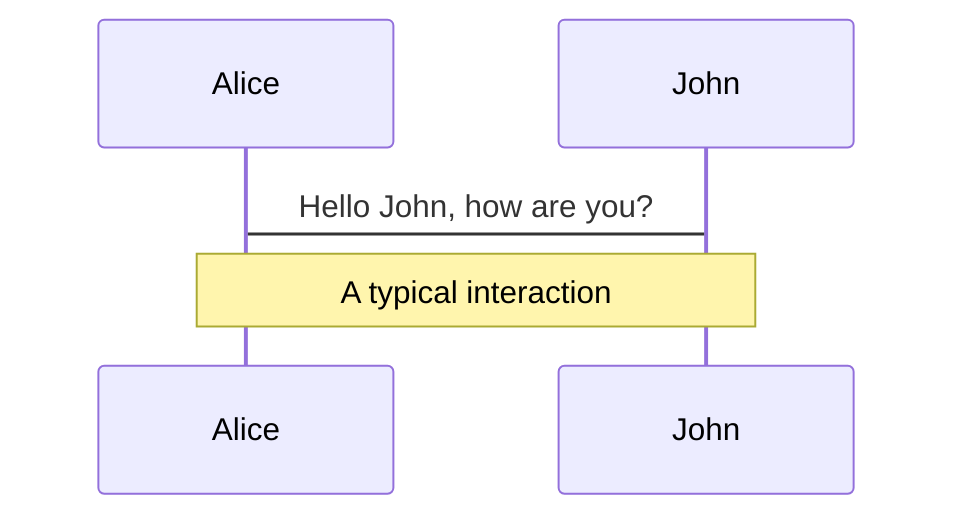
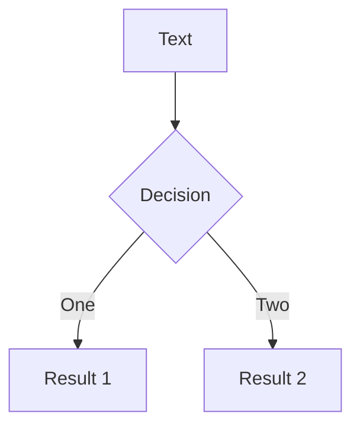
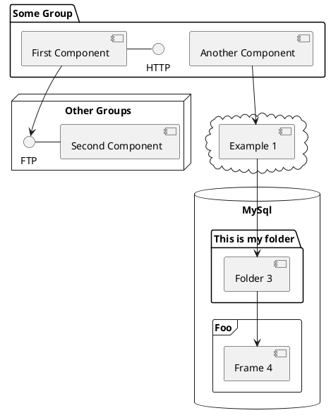

---
# try also 'default' to start simple
theme: seriph
# random image from a curated Unsplash collection by Anthony
# like them? see https://unsplash.com/collections/94734566/slidev
background: https://user-images.githubusercontent.com/8760841/199149866-a43ad2fd-a184-4eef-ba09-023a507fcd88.png
# apply any windi css classes to the current slide
class: 'text-center'
# https://sli.dev/custom/highlighters.html
highlighter: shiki
# show line numbers in code blocks
lineNumbers: false
# some information about the slides, markdown enabled
info: |
  ## Slidev Starter Template
  Presentation slides for developers.

  Learn more at [Sli.dev](https://sli.dev)
# persist drawings in exports and build
drawings:
  persist: false
# use UnoCSS
css: unocss
---

# Tsunami Visualization 3D Map

<!-- For OSS4SDG Sustainable Cities & Communities Hackathon -->

<div class="pt-12">
  <span @click="$slidev.nav.next" class="px-2 py-1 rounded cursor-pointer" hover="bg-white bg-opacity-10">
    For OSS4SDG Sustainable Cities & Communities Hackathon<br/>
    Challenge # 4 – Disaster risk manager<br/>
    Naoki Ohashi
  </span>
</div>

<div class="abs-br m-6 flex gap-2">
  <button @click="$slidev.nav.openInEditor()" title="Open in Editor" class="text-xl icon-btn opacity-50 !border-none !hover:text-white">
    <carbon:edit />
  </button>
  <a href="https://github.com/slidevjs/slidev" target="_blank" alt="GitHub"
    class="text-xl icon-btn opacity-50 !border-none !hover:text-white">
    <carbon-logo-github />
  </a>
</div>

<!--
The last comment block of each slide will be treated as slide notes. It will be visible and editable in Presenter Mode along with the slide. [Read more in the docs](https://sli.dev/guide/syntax.html#notes)
-->
---
layout: image-right
image: https://avatars.githubusercontent.com/u/8760841
---

# 自己紹介

- Naoki Ohashi

- 株式会社 Geolonia所属 エンジニア
- 国連ベクトルタイルツールキットメンバー

- Geolonia では地図スタイル開発を担当。UNVTでは、主に Charites に貢献しています。
- GitHub: https://github.com/naogify
- Twitter: https://twitter.com/naogify

---
layout: image-right
image: /japan.png
---

# I live in here

- Kumamoto town, Wakayama Prefecture, Japan
- Northern part of main island of Japan
- 世界津波の日 2021/03/11で、の元になった稲村の火 で有名

---

# 南海トラフ地震が予想されている

---

# What I built

- Tsunami visualization map for Nankai Trough Mega Earthquake (Kushimoto, Wakayama, Japan).
- Calculated per 10㎡
- 0min to 60min after the earthquake
- depth of tsunami
- the blue pin markers indicating evacuation centers,

---

# DEMO

---

# Why I built

- I wanted to know the tsunami risk in my hometown.

I live in Kushimoto, Wakayama Prefecture, Japan, where a major earthquake called the Nankai Trough Earthquake is said to be possible.

If it happens, it is expected to cause extensive damage.

The government has published static disaster prevention maps,  and this time I created a 3d interactive tsunami simulation map based on the tsunami prediction data published by the government.

Compared to ordinary disaster prevention maps, this map allows you to zoom in on any location you like and see the height of the waves in 3D. 

---

# 津波予測データ

- 内閣府が公開している津波予測データを利用
- Calculated per 10㎡

```csv
"lon","lat","Published value of flood depth (m)","Arrival time_01cm (sec)","Arrival time_30cm (sec)","Arrival time_01m (sec)", "Arrival time_03m (sec)", "Arrival time_05m (sec)", "Arrival time_10m (sec)", "Arrival time_20m (sec)", "Arrival time_30m (sec)", "Arrival time_40m (sec)", "Arrival time_Max water level (sec)", "Reference value: Inundation depth (m)", "Reference value Elevation after crustal movement (m)", "Reference value: uplift (m)", "Reference value: uplift (m)"
136.757955,34.269976,1,1240,1241,-9999,-9999,-9999,-9999,-9999,-9999,-9999,1243,0.95,12.93,-0.89
136.758064,34.269976,2,1242,1269,1308,-9999,-9999,-9999,-9999,-9999,-9999,1308,1.10,11.79,-0.89
136.758172,34.269975,6,1241,1257,1259,1266,1304,-9999,-9999,-9999,-9999,1304,5.17,7.47,-0.89
136.758281,34.269974,7,1239,1250,1252,1254,1263,-9999,-9999,-9999,-9999,1305,6.95,5.44,-0.89
136.758390,34.269974,8,941,1241,1242,1247,1256,-9999,-9999,-9999,-9999,1303,7.66,4.59,-0.89
136.758498,34.269973,7,1239,1241,1242,1246,1259,-9999,-9999,-9999,-9999,1303,6.78,5.10,-0.89
136.758607,34.269972,6,1241,1242,1243,1248,1286,-9999,-9999,-9999,-9999,1301,5.97,5.43,-0.89
136.758715,34.269972,6,1241,1243,1244,1248,1284,-9999,-9999,-9999,-9999,1326,6.01,5.49,-0.89
```

---

# How I built

---

# データの加工

1. Clip Kushimoto area

```js
node bboxClip.js
```
https://github.com/naogify/nankai-trough-map/blob/main/bin/bboxClip.js

2. create 10m grid from northWest lon, lat

```js
node point2mesh.js
```
https://github.com/naogify/nankai-trough-map/blob/main/bin/point2mesh.js


3. convert csv to geojson
```js
node csv2geojson.js
```
https://github.com/naogify/nankai-trough-map/blob/main/bin/csv2geojson.js


4. create vector tile by tippecanoe
```js
tippecanoe -zg -o tsunami.mbtiles -l g-simplestyle-v1 --drop-densest-as-needed ./data.geojson
```

---

# 可視化

3. スタイルを当てる

Add Layer
```
  map.addLayer({
    id: 'tsunami-1cm',
    ...baseLayer,
    paint: {
      ...baseLayer.paint,
      'fill-extrusion-height': 0.01, // 1cm
      'fill-extrusion-color': '#FFF323'
    }
  }, 'poi');
```

SetFilter by current time to visible appropriate layer.
```
map.setFilter('tsunami-1cm', compareNow('到達時間_01cm_s', '到達時間_30cm_s', currentTime));
```


---

# 使用したオープンデータ

Tsunami Simulation Data
- 内閣府 南海トラフの巨大地震モデル検討会」（津波断層モデル(11)津波浸水深データ（ケース1）ケース02_堤防破堤）（https://www.geospatial.jp/ckan/dataset/1211）

Map Data
- Geolonia
- OpenStreetMap
- GSI Japan
 - DEM（https://maps.gsi.go.jp/development/ichiran.html#dem）
 - gsimaps-vector-experiment（https://github.com/gsi-cyberjapan/gsimaps-vector-experiment）

Style
- Geolonia GSI （https://github.com/geoloniamaps/gsi）

---

# Thank you

---

# Who am I

Slidev is a slides maker and presenter designed for developers, consist of the following features

- 📝 **Text-based** - focus on the content with Markdown, and then style them later
- 🎨 **Themable** - theme can be shared and used with npm packages
- 🧑‍💻 **Developer Friendly** - code highlighting, live coding with autocompletion
- 🤹 **Interactive** - embedding Vue components to enhance your expressions
- 🎥 **Recording** - built-in recording and camera view
- 📤 **Portable** - export into PDF, PNGs, or even a hostable SPA
- 🛠 **Hackable** - anything possible on a webpage

<br>
<br>

Read more about [Why Slidev?](https://sli.dev/guide/why)

<!--
You can have `style` tag in markdown to override the style for the current page.
Learn more: https://sli.dev/guide/syntax#embedded-styles
-->

<style>
h1 {
  background-color: #2B90B6;
  background-image: linear-gradient(45deg, #4EC5D4 10%, #146b8c 20%);
  background-size: 100%;
  -webkit-background-clip: text;
  -moz-background-clip: text;
  -webkit-text-fill-color: transparent;
  -moz-text-fill-color: transparent;
}
</style>

<!--
Here is another comment.
-->

---

# Navigation

Hover on the bottom-left corner to see the navigation's controls panel, [learn more](https://sli.dev/guide/navigation.html)

### Keyboard Shortcuts

|     |     |
| --- | --- |
| <kbd>right</kbd> / <kbd>space</kbd>| next animation or slide |
| <kbd>left</kbd>  / <kbd>shift</kbd><kbd>space</kbd> | previous animation or slide |
| <kbd>up</kbd> | previous slide |
| <kbd>down</kbd> | next slide |

<!-- https://sli.dev/guide/animations.html#click-animations -->

<p v-after class="absolute bottom-23 left-45 opacity-30 transform -rotate-10">Here!</p>

---
layout: image-right
image: https://source.unsplash.com/collection/94734566/1920x1080
---

# Code

Use code snippets and get the highlighting directly![^1]

```ts {all|2|1-6|9|all}
interface User {
  id: number
  firstName: string
  lastName: string
  role: string
}

function updateUser(id: number, update: User) {
  const user = getUser(id)
  const newUser = { ...user, ...update }
  saveUser(id, newUser)
}
```

<arrow v-click="3" x1="400" y1="420" x2="230" y2="330" color="#564" width="3" arrowSize="1" />

[^1]: [Learn More](https://sli.dev/guide/syntax.html#line-highlighting)

<style>
.footnotes-sep {
  @apply mt-20 opacity-10;
}
.footnotes {
  @apply text-sm opacity-75;
}
.footnote-backref {
  display: none;
}
</style>

---

# Components

<div grid="~ cols-2 gap-4">
<div>

You can use Vue components directly inside your slides.

We have provided a few built-in components like `<Tweet/>` and `<Youtube/>` that you can use directly. And adding your custom components is also super easy.

```html
<Counter :count="10" />
```

<!-- ./components/Counter.vue -->
<Counter :count="10" m="t-4" />

Check out [the guides](https://sli.dev/builtin/components.html) for more.

</div>
<div>

```html
<Tweet id="1390115482657726468" />
```

<Tweet id="1390115482657726468" scale="0.65" />

</div>
</div>

<!--
Presenter note with **bold**, *italic*, and ~~striked~~ text.

Also, HTML elements are valid:
<div class="flex w-full">
  <span style="flex-grow: 1;">Left content</span>
  <span>Right content</span>
</div>
-->


---
class: px-20
---

# Themes

Slidev comes with powerful theming support. Themes can provide styles, layouts, components, or even configurations for tools. Switching between themes by just **one edit** in your frontmatter:

<div grid="~ cols-2 gap-2" m="-t-2">

```yaml
---
theme: default
---
```

```yaml
---
theme: seriph
---
```


</div>

Read more about [How to use a theme](https://sli.dev/themes/use.html) and
check out the [Awesome Themes Gallery](https://sli.dev/themes/gallery.html).

---
preload: false
---

# Animations

Animations are powered by [@vueuse/motion](https://motion.vueuse.org/).

```html
<div
  v-motion
  :initial="{ x: -80 }"
  :enter="{ x: 0 }">
  Slidev
</div>
```

<div class="w-60 relative mt-6">
  <div class="relative w-40 h-40">
    
    
    
  </div>

  <div
    class="text-5xl absolute top-14 left-40 text-[#2B90B6] -z-1"
    v-motion
    :initial="{ x: -80, opacity: 0}"
    :enter="{ x: 0, opacity: 1, transition: { delay: 2000, duration: 1000 } }">
    Slidev
  </div>
</div>

<!-- vue script setup scripts can be directly used in markdown, and will only affects current page -->
<script setup lang="ts">
const final = {
  x: 0,
  y: 0,
  rotate: 0,
  scale: 1,
  transition: {
    type: 'spring',
    damping: 10,
    stiffness: 20,
    mass: 2
  }
}
</script>

<div
  v-motion
  :initial="{ x:35, y: 40, opacity: 0}"
  :enter="{ y: 0, opacity: 1, transition: { delay: 3500 } }">

[Learn More](https://sli.dev/guide/animations.html#motion)

</div>

---

# LaTeX

LaTeX is supported out-of-box powered by [KaTeX](https://katex.org/).

<br>

Inline $\sqrt{3x-1}+(1+x)^2$

Block
$$
\begin{array}{c}

\nabla \times \vec{\mathbf{B}} -\, \frac1c\, \frac{\partial\vec{\mathbf{E}}}{\partial t} &
= \frac{4\pi}{c}\vec{\mathbf{j}}    \nabla \cdot \vec{\mathbf{E}} & = 4 \pi \rho \\

\nabla \times \vec{\mathbf{E}}\, +\, \frac1c\, \frac{\partial\vec{\mathbf{B}}}{\partial t} & = \vec{\mathbf{0}} \\

\nabla \cdot \vec{\mathbf{B}} & = 0

\end{array}
$$

<br>

[Learn more](https://sli.dev/guide/syntax#latex)

---

# Diagrams

You can create diagrams / graphs from textual descriptions, directly in your Markdown.

<div class="grid grid-cols-3 gap-10 pt-4 -mb-6">







</div>

[Learn More](https://sli.dev/guide/syntax.html#diagrams)

---
src: ./pages/multiple-entries.md
hide: false
---

---
layout: center
class: text-center
---

# Learn More

[Documentations](https://sli.dev) · [GitHub](https://github.com/slidevjs/slidev) · [Showcases](https://sli.dev/showcases.html)

